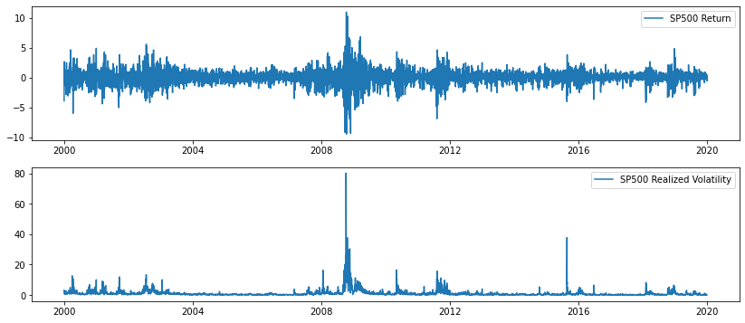

# RUN TIME ANALYSIS of 'CONCURRENT' and 'NUMBA' for FORECASTING VOLATILITY with GARCH MODEL

In this note, I present run time results of different codes for an out-of-sample forecasting exercise with GARCH(1,1) process. Specifically, first, I compute one step ahead forecasts of plain GARCH(1,1) for SP500 returns. Then, I rewrite the code by exploiting 'Numba' module and compute the predictions as before. As a third step, I improve the plain GARCH(1,1) code with multiprocessing, i.e. parallelization, whic is available in the 'Concurrent' module. Finally, I use 'Numba' and multiprocessing at the same time in my code. In each of these 4 case, I report the run times of the code.


```python
# libraries
import numpy as np
import pandas as pd
import matplotlib.pyplot as plt
from datetime import datetime
from time import perf_counter
from concurrent import futures
import warnings
warnings.filterwarnings("ignore")
%matplotlib inline
```

## Data

I use SP500 return data between 1 Jan 2000 and 31 Dec 2019 which corresponds 5030 data points. 

The last 100 days are taken as out-of-sample period and the rest is the estimation sample. For each day in out-of-sample, first I estimate GARCH(1,1) model with available data and compute 1 step ahead forecast. 


```python
# read the data
data = pd.read_excel("SP500_VIX_RV.xlsx")
data.Date = pd.to_datetime(data.Date, format= "%Y%m%d")

# variables of interest
date = data.Date
return_SP500 = np.asarray(data.SP500)

# rule out 2020 year data
return_SP500 = return_SP500[date<datetime(2020,1,1)]
date = date[date<datetime(2020,1,1)]

# demean return 
return_SP500 = return_SP500 - return_SP500.mean()

# sample size
T = len(return_SP500)

# determine the estimation and out of sample
w = 100 # out-of-sample window
r_est = return_SP500[:T-w]
r_oos = return_SP500[T-w:]

# plot the series
fig, axs = plt.subplots(1)
fig.set_figwidth(7)
fig.set_figheight(3)
axs.plot(date, return_SP500, label='SP500 Return')
axs.legend()
plt.show()
```


    

    


## Simple GARCH(1,1)

I call necessary functions from `garch.py` script. `garch_forecast` function takes a return series as an input and outputs 1-step-ahead forecast. Particularly, it estimates a GARCH(1,1) model using whole data and then computes 1-step-ahead forecast given estimated parameters. In this simple exercise, I compute all forecast in a`for` loop. Hence, this method can be regarded as "Recursive Optimization".


```python
from garch import garch_forecast

start = perf_counter()

sigma2_oos = np.zeros(w)
for i in range(w):
    
    temp = garch_forecast(return_SP500[:T-w+i])
    sigma2_oos[i] = temp

stop = perf_counter()

print('Running Time: ', stop - start)  
```

    Running Time:  114.09428651700728


## Simple GARCH(1,1) + Multiprocessing

For this step, I parallize previous `for` loop using `concurrent` module. 


```python
from garch import garch_forecast

start = perf_counter()

with futures.ProcessPoolExecutor(max_workers=8) as executor:
    to_do = {}
    for i in range(w):
        future = executor.submit(garch_forecast, return_SP500[:T-w+i])
        to_do[future] = i
        
    sigma2_oos = np.zeros(w)
    for future in futures.as_completed(to_do.keys()):
        i = to_do[future]
        sigma2_oos[i] = future.result()
        
stop = perf_counter()

print('Running Time: ', stop - start)  
```

    Running Time:  15.248896284028888


## Simple GARCH(1,1) + Numba

I rewrite `garch.py` script by adding `@njit` decorator and name its as `garch_v2.py`. This decorator compiles my code with its 'just in time compiler. For more information check ["Numba"](https://numba.pydata.org/) documentation. As in the first case, I recursive optimization in `for` loop.


```python
from garch_v2 import garch_forecast

start = perf_counter()

sigma2_oos = np.zeros(w)
for i in range(w):
    
    temp = garch_forecast(return_SP500[:T-w+i])
    sigma2_oos[i] = temp

stop = perf_counter()

print('Running Time: ', stop - start)  
```

    Running Time:  1.796261154988315


## Simple GARCH(1,1) + Multiprocessing + Numba

Finally, I parallelize the `garch_forecast` function which is written with `@njit`. 


```python
from garch_v2 import garch_forecast

start = perf_counter()

with futures.ProcessPoolExecutor(max_workers=8) as executor:
    to_do = {}
    for i in range(w):
        future = executor.submit(garch_forecast, return_SP500[:T-w+i])
        to_do[future] = i
        
    sigma2_oos = np.zeros(w)
    for future in futures.as_completed(to_do.keys()):
        i = to_do[future]
        sigma2_oos[i] = future.result()
        
stop = perf_counter()

print('Running Time: ', stop - start)  
```

    Running Time:  0.27071250503649935


## Comments

| Method | Time in Seconds |
| ----   | ---- |
| Simple GARCH (Recursive Optimization) | 114 |
| Simple GARCH + Parallelization | 15 |
| Simple GARCH + Numba | 1.8 |
| Simple GARCH + Parallelization + Numba | 0.27 |

In this out-of-sample exercise, I forecast volatility for 100 days. The first case implies roughly 1 second for each day. Therefore, for longer periods, it takes too much time. My computer has 8 cores and parellelization speeds it up approximately 8 times. Moreover, when I use `numba`, the gain becomes more than 60x. This is a massive improvement. Finally, my analysis show that `numba` together with parallelization brings further improvement and the running time drops to 0.27 seconds from 114 seconds. In my opinion, both modules, `numba` and `concurrent`, are very useful for forecasting exercises so that one can save a lot time.  


```python

```
